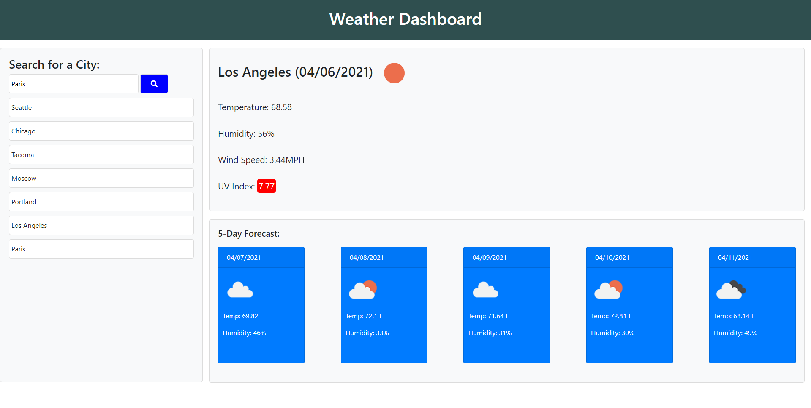

# weather-dashboard
06 Server-Side APIs: Weather Dashboard Homework

## description
This weather-dashboard was created for a homework assignment as part of the uw coding bootcamp.

With this app you can search for the current weather and 5-day forcast of any city you desire. The weather information you search for will populate in the two sections to the right of the search bar. Any searches you perform will be saved in a list below the search bar.

Link: https://brooks-t.github.io/weather-dashboard/

